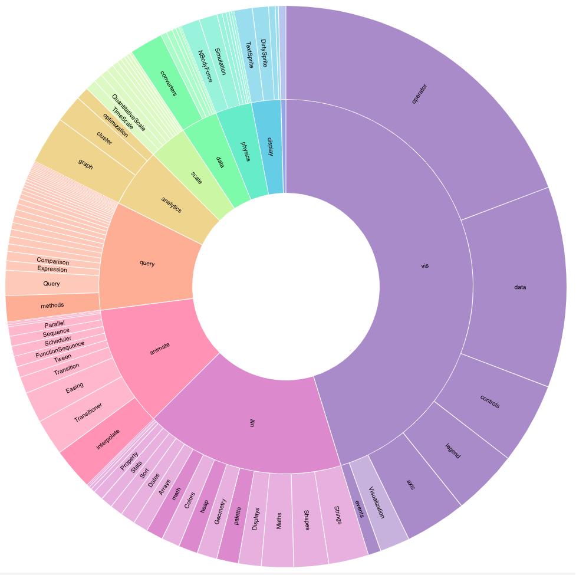

# FS Zoomable Sunburst

Visualise a filesystem as a [Zoomable Sunburst](https://observablehq.com/@d3/zoomable-sunburst).

A [.gitignore](https://git-scm.com/docs/gitignore) file can be used to exclude files from the output.

```sh
npm install -g fs-zoomable-sunburst
fs-zoomable-sunburst [path to dir] > data.json
# Replace flare-2.json file here https://observablehq.com/@d3/zoomable-sunburst
```

